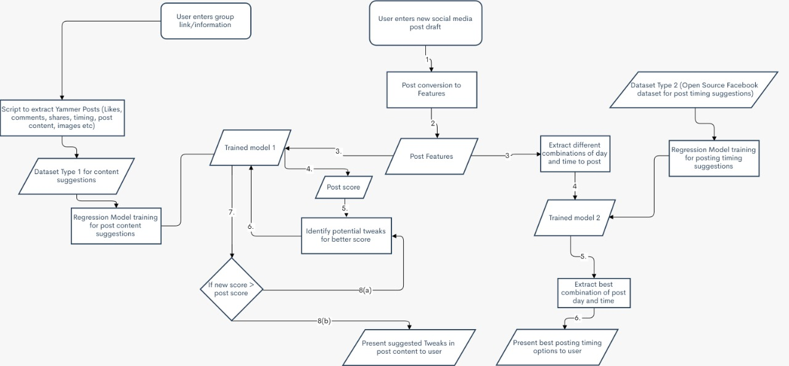

# YammerPredictiveAnalytics

Try out the app at [AlphaAI](https://yammerposthelper.herokuapp.com/).

This app was made with idea to improve employee engagement in enterprise social media like Yammer

The App helps users with 2 things

 1. Suggest best posting timings to users so posts can reach a larger audience
 2. Suggest minor tweaks and suggestions to your post content (by inclusion of hashtags, questions, URLs to web sources, images of different types, videos etc.)

All suggestions are made after taking into account the usage statistics of the social media group the user is in.

The workflow diagram of the project is as follows:

</img>

The tweaks suggestion works by taking the content of the post the user wants to publish and computing a vector
A vector that looks like this:

</img>

By training a model on an existing dataset for these posts, I compute the engagement score(a metric that involves number of likes, comments and shares) for the user's post.
After trying some manual tweaks to the vector, I try tweaking the vector and see if my model predicts a higher engagement score.
The tweak with the highest increase in engagement score is suggested first

